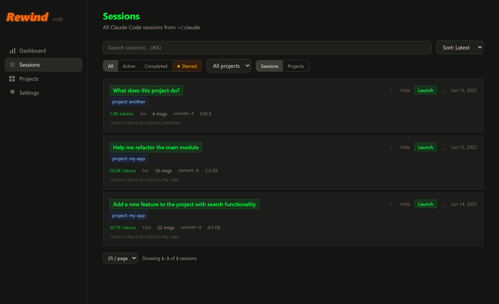
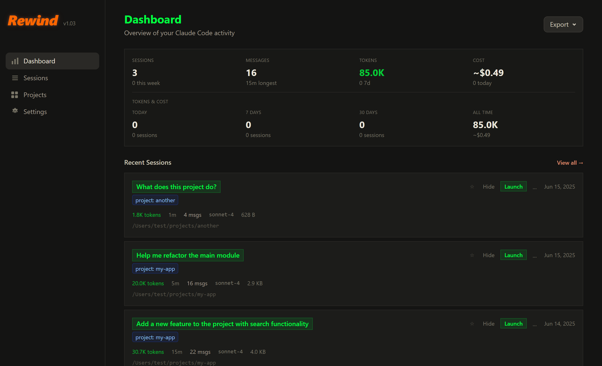

# Rewind

**Your Claude Code sessions deserve better than `~/.claude/projects/`.**

A local dashboard for [Claude Code](https://docs.anthropic.com/en/docs/claude-code) power users who've accumulated more sessions than they can remember. Browse, search, star, rename, and launch past sessions from a clean web UI. See what's actively running, what it cost you, and which project quietly consumed 3.2M tokens at 3am.

Everything runs locally. Nothing phones home. We don't even know how to spell "telemetry."



---

## Features

### Sessions — your command center

| Feature | What it does |
|---------|-------------|
| **Star** | Pin important sessions to the top. They earned it. |
| **Rename** | Give sessions real names. "chat-abc123" is not a personality. |
| **Launch** | One click to resume any session in your terminal. |
| **Active detection** | See which sessions are running right now (comforting green glow included). |
| **Sort** | By latest, most messages, longest, largest, or starred only. |
| **Copy resume** | `claude --resume <id>` to clipboard from the `...` menu. |

### Search — find that one session from last Tuesday

- **`Cmd+K`** / **`Ctrl+K`** — muscle memory, we got you
- **Full-text conversation search** — not just titles, but what was actually said
- **Project filter** — dropdown or click a project badge on any card

### Projects — tame the chaos

- **Rename, star, or hide** projects from the dedicated Projects page
- **Project badges** — clickable labels on every session card
- **Starred project surfacing** — latest session from your starred projects floats to the top of the dashboard

### Dashboard & Stats — know your usage

- **At-a-glance metrics** — sessions, messages, tokens, estimated cost
- **Activity heatmap** — like GitHub's contribution graph, but for your AI conversations
- **Token usage over time** — daily or weekly, broken down by model
- **Hourly distribution** — discover that you apparently code at 2am more than you thought



### Conversation Viewer

Full chat history on the session detail page — every message, tool call, and timestamp. For when you need to figure out what you asked Claude to do before your morning coffee.

---

## Quick Start

```bash
git clone https://github.com/mr-godot/rewind-dashboard.git
cd rewind-dashboard/apps/web
npm install
npx vite --port 3030
```

Open **http://localhost:3030**. That's it.

### Prerequisites

- **Node.js 18+** — install instructions per OS below
- **Claude Code** installed — Rewind reads session data from `~/.claude/projects/`
- At least one Claude Code session (go talk to Claude, we'll wait)

<details>
<summary><b>Install Node.js — Windows</b></summary>

```powershell
winget install OpenJS.NodeJS.LTS
```

Or grab the installer from [nodejs.org](https://nodejs.org/en/download). Then run the four Quick Start commands above in **PowerShell** or **Windows Terminal**.
</details>

<details>
<summary><b>Install Node.js — macOS</b></summary>

```bash
brew install node
```

Or download from [nodejs.org](https://nodejs.org/en/download). Then run the four Quick Start commands above.
</details>

<details>
<summary><b>Install Node.js — Linux</b></summary>

```bash
# Debian / Ubuntu
sudo apt install -y nodejs npm

# …or via nvm (recommended for an up-to-date version)
curl -o- https://raw.githubusercontent.com/nvm-sh/nvm/v0.40.1/install.sh | bash
nvm install --lts
```

Then run the four Quick Start commands above.

> Linux is fully supported (the app is pure Node + browser) but less battle-tested than Windows and macOS — bug reports welcome. The in-terminal **Launch** button uses `gnome-terminal`, `konsole`, or `xterm`.
</details>

### Your first 30 seconds

1. **Browse** — sessions appear on the Dashboard, sorted by most recent
2. **Star** — click ★ to pin a session to the top
3. **Rename** — click `...` → Rename (you'll thank yourself later)
4. **Search** — `Cmd+K` to find anything across all sessions
5. **Launch** — green button resumes any session in your terminal
6. **Projects** — sidebar link to organize, star, and hide projects

---

## How It Works

Claude Code stores sessions as JSONL files under `~/.claude/projects/`. Rewind scans them on a timer and presents a proper UI:

- **Sessions** — parsed from JSONL: timestamps, messages, tokens, tool calls, models
- **Active detection** — dual-strategy: lock directory check (15min threshold) + file modification time (2min) for newer Claude Code versions
- **Metadata** — your pins, renames, and hidden projects live in `~/.claude-dashboard/session-metadata.json`
- **Launch** — cross-platform session resume:
  - **Windows**: titled `.bat` script via `cmd.exe /c start "Rewind Session <id>"` (self-deletes on exit)
  - **macOS**: `osascript` with Terminal.app
  - **Linux**: `gnome-terminal` / `konsole` / `xterm`

Zero network requests. Your sessions stay on your machine.

---

## Auto-Start on Login

<details>
<summary><b>Windows</b> — scheduled task</summary>

Create `start-rewind.vbs`:

```vbs
Set WshShell = CreateObject("WScript.Shell")
WshShell.Run "cmd /c cd /d ""C:\path\to\rewind-dashboard\apps\web"" && npx vite --port 3030", 0, False
```

Register as a scheduled task:

```powershell
$action = New-ScheduledTaskAction -Execute "wscript.exe" -Argument '"C:\path\to\start-rewind.vbs"'
$trigger = New-ScheduledTaskTrigger -AtLogOn
Register-ScheduledTask -TaskName "RewindDashboard" -Action $action -Trigger $trigger
```
</details>

<details>
<summary><b>macOS</b> — launch agent</summary>

```bash
cat > ~/Library/LaunchAgents/com.rewind-dashboard.plist << 'EOF'
<?xml version="1.0" encoding="UTF-8"?>
<!DOCTYPE plist PUBLIC "-//Apple//DTD PLIST 1.0//EN" "http://www.apple.com/DTDs/PropertyList-1.0.dtd">
<plist version="1.0">
<dict>
    <key>Label</key><string>com.rewind-dashboard</string>
    <key>ProgramArguments</key>
    <array><string>npx</string><string>vite</string><string>--port</string><string>3030</string></array>
    <key>WorkingDirectory</key><string>/path/to/rewind-dashboard/apps/web</string>
    <key>RunAtLoad</key><true/>
    <key>KeepAlive</key><true/>
</dict>
</plist>
EOF
launchctl load ~/Library/LaunchAgents/com.rewind-dashboard.plist
```
</details>

<details>
<summary><b>Linux</b> — systemd user service</summary>

```bash
mkdir -p ~/.config/systemd/user
cat > ~/.config/systemd/user/rewind-dashboard.service << 'EOF'
[Unit]
Description=Rewind Dashboard

[Service]
WorkingDirectory=/path/to/rewind-dashboard/apps/web
ExecStart=npx vite --port 3030
Restart=on-failure

[Install]
WantedBy=default.target
EOF
systemctl --user enable --now rewind-dashboard
```
</details>

---

## Mobile Access (Experimental)

Rewind is a web app — any browser works. Start with `npx vite --port 3030 --host 0.0.0.0`, then open `http://<your-ip>:3030` from your phone. Add to Home Screen for an app-like experience.

For remote access: [Tailscale](https://tailscale.com) or [Cloudflare Tunnel](https://developers.cloudflare.com/cloudflare-one/connections/connect-apps/) work great.

> The Launch button won't work from mobile (no terminal). Everything else does.

## Troubleshooting

### "What is this terminal window?"

When you click **Launch**, Rewind opens a new terminal window running `claude --resume`. On Windows, this window is titled **`Rewind Session <id-prefix>`** (where `<id-prefix>` is the first 8 characters of the session UUID) so you can confirm it came from Rewind. You can close these windows at any time — closing the terminal ends that Claude session but does not affect the dashboard or other sessions.

### Orphan terminals from older versions

Versions of Rewind prior to this fix could occasionally leave unlabeled `cmd.exe` windows behind after a Claude session ended or the Vite dev server was killed. If you see unfamiliar console windows on your desktop with no obvious title, they are almost certainly harmless orphans from a previous session — just close them, or kill them via PowerShell:

```powershell
Get-Process cmd | Where-Object { $_.MainWindowTitle -eq '' } | Stop-Process
```

New launches (with the titled-window fix) no longer produce these orphans, and the temporary `.bat` files they spawn self-delete when the terminal exits.

---

## Tech Stack

[TanStack Start](https://tanstack.com/start) + [React](https://react.dev) · [TanStack Router](https://tanstack.com/router) + [React Query](https://tanstack.com/query) · [Tailwind CSS v4](https://tailwindcss.com) · [Vite](https://vite.dev) · [Zod](https://zod.dev)

## Development

```bash
cd apps/web
npm install
npx vite --port 3030      # dev server
npx vitest                 # tests
```

> **Note**: Both dev mode (`npx vite --port 3030`) and the production build (`npm run build` then `npm start`) work. The in-app **Launch session** button only works in dev mode, since its endpoint runs as Vite dev-server middleware.

---

## Credits

Built on [claude-session-dashboard](https://github.com/dlupiak/claude-session-dashboard) by [Dmytro Lupiak](https://github.com/dlupiak) — a read-only analytics viewer for Claude Code. Rewind adds session management, conversation viewing, project organization, active session detection, and cross-platform session launching.

## License

[MIT](LICENSE) © 2026 Godot Huard.
